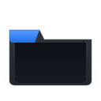
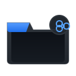
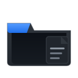
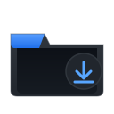
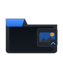
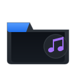
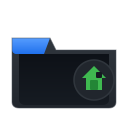
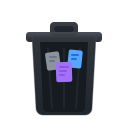

# LinkUp Studio Icon Pack - Manifest

## Overview

A complete premium icon pack for Windows 10/11 featuring GitHub Dark + Fluent + Minimal design language.

## Icon List

### Folder Icons

| Icon | Filename | Description |
|------|----------|-------------|
|  | `folder-closed` | Standard folder (closed state) |
|  | `folder-open` | Open folder |
|  | `folder-shared` | Shared/network folder |
|  | `folder-documents` | Documents folder |
|  | `folder-downloads` | Downloads folder |
|  | `folder-pictures` | Pictures folder |
|  | `folder-music` | Music folder |
|  | `folder-videos` | Videos folder |
|  | `folder-home` | Home folder |

### System Icons

| Icon | Filename | Description |
|------|----------|-------------|
|  | `desktop` | Desktop computer |
|  | `drive-harddisk` | Local disk / Hard drive |
|  | `recycle-bin-empty` | Empty recycle bin |
|  | `recycle-bin-full` | Full recycle bin |

## File Formats

### SVG (Source)
- **Location:** `source/` and `svg/128/`, `svg/256/`
- **Usage:** Vector source, scales to any size
- **Best for:** Web, print, custom sizes

### PNG (Raster)
- **Location:** `png/16/`, `png/24/`, `png/32/`, `png/48/`, `png/64/`, `png/128/`, `png/256/`
- **Sizes:** 16x16, 24x24, 32x32, 48x48, 64x64, 128x128, 256x256
- **Best for:** UI elements, web, presentations

### ICO (Windows)
- **Location:** `ico/`
- **Contains:** Multiple resolutions in single file
- **Best for:** Windows shortcuts, executables, favicons

## Design Specifications

### Color Palette

| Role | Color | Hex |
|------|-------|-----|
| Primary Background | Dark | `#21262d` |
| Secondary Background | Darker | `#161b22` |
| Border/Accent | Gray | `#30363d` |
| Text/Icons | Light Gray | `#8b949e` |
| Primary Accent | Blue | `#58a6ff` |
| Tab Accent | Blue Dark | `#1f6feb` |
| Success | Green | `#3fb950` |
| Warning | Orange | `#d29922` |
| Danger | Red | `#f85149` |
| Purple | Purple | `#a371f7` |

### Style Guidelines

- **Design System:** GitHub Dark + Fluent + Minimal
- **Corner Radius:** 4-8px (Fluent-inspired)
- **Shadows:** Subtle drop shadows for depth
- **Highlights:** Top-edge highlights for Fluent effect
- **Gradients:** Subtle vertical gradients for depth

## Usage

### Windows Folder Icons

1. Navigate to folder
2. Right-click → Properties → Customize → Change Icon
3. Browse to `ico/folder-closed.ico`

### Windows System Icons

Replace system icons using:
- Registry modifications
- Resource Hacker
- Or third-party tools like **Icon Changer**

### Custom Applications

Use the PNG or ICO files in your applications:
```html

```

## Regenerating Icons

If you modify the SVG source files, regenerate all PNG/ICO files:

```bash
cd icons
python generate-icons.py
```

## License

These icons are created for LinkUp Studio and are free to use in personal and commercial projects.

---

**Part of LinkUp Studio - Premium Windows Developer Environment**